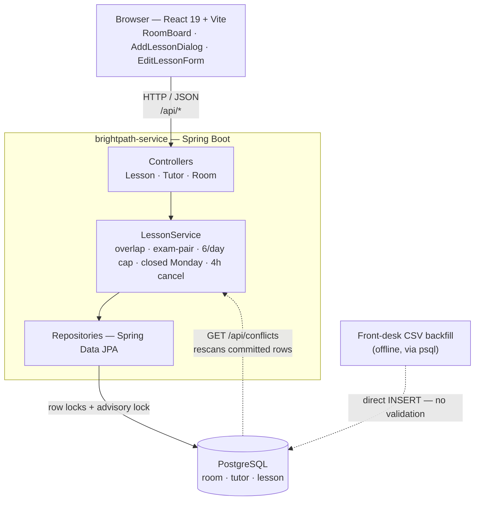
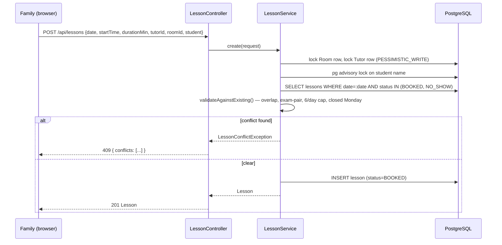
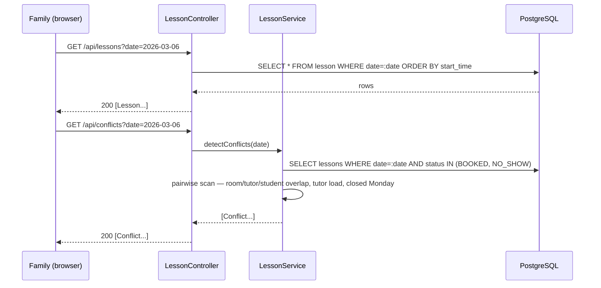

# DECISIONS.md — Bright Path Learning Centre, scheduling & conflict detection

## 1. Context

Bright Path is a small tutoring centre with 6 rooms and 12 tutors, run day-to-day by a receptionist
booking 1:1, 60- or 90-minute lessons by hand. The one failure that matters to the owner is a room,
tutor, or student getting double-booked — "if the system allows it, the system is broken." This system
replaces manual booking with an app that a family can use directly, with double-booking prevented
structurally (server-side, before a lesson is ever saved) instead of depending on someone holding the
whole day's schedule in their head.

## 2. Requirements

### Functional

- Book a lesson: student, tutor, room, date, start time, duration (60 or 90 min).
- Cancel a booked lesson; cancelling within 4 hours of start is flagged chargeable in the response.
- Edit (reschedule) a booked lesson's tutor, room, date, or time.
- View a day's schedule, and the conflicts already present in it.
- Prevent: overlapping bookings in the same room; a tutor double-booked; a student double-booked; a
  tutor exceeding 6 lessons/day; a new booking on a Monday (the centre is closed).
- Allow exactly one deliberate exception: two lessons sharing a room, tutor, start time and duration with
  two _different_ students (the "exam pair" case) — a third lesson on that same slot is rejected like any
  other conflict.
- Bulk-load historical lessons from a front-desk CSV export without forcing them through the same-day
  validation a live booking gets, but still be able to surface whatever rule violations that import
  carries — a lesson already on a Monday, a tutor already over 6/day, etc.

### Non-functional / explicitly out of scope

- Single centre, ~12 tutors, one receptionist's laptop — no need for horizontal scale, so writes are
  serialized with row locks rather than resolved optimistically.
- No auth or access control. The frontend's "signed in as" name gates which UI buttons render; the API
  itself has no session and takes no user identity.
- No admin UI for tutors/rooms — the roster is edited directly in `data.sql`.
- No notification path — a moved/cancelled lesson has no way to reach the tutor other than opening the
  tool.
- Student identity is a trimmed, case-insensitive name string, not an id — no `Student` table.

## 3. Data Model

- `Tutor(id, name, subject, phone)` — 12 rows, 3 each across Maths, English, Physics, Chemistry.
- `Room(id, label)` — 6 fixed rows.
- `Lesson(id, date, startTime, durationMin, student, tutorId, roomId, status, cancelledAt, note, movedFromLessonId, createdAt)`
  `status ∈ {BOOKED, CANCELLED, NO_SHOW, MOVED}`.

```
BOOKED / NO_SHOW  → occupy the room + tutor + student slot
CANCELLED / MOVED → free it
```

- Cancelling sets `status → CANCELLED` and records `cancelledAt`; the row is never deleted.
- Rescheduling never mutates a lesson in place: the old row's `status → MOVED` (`cancelledAt` stays
  null), and a new row is inserted with `movedFromLessonId` pointing back at it. There is no
  `PUT /api/lessons/{id}` — every move goes through `reschedule`, so a change is always a new row, never a
  silent overwrite.

## 4. API Design

| Method | Path                           | Purpose                                                   |
| ------ | ------------------------------ | --------------------------------------------------------- |
| GET    | `/api/lessons?date=`           | A day's schedule                                          |
| GET    | `/api/conflicts?date=`         | Conflicts already present in that day's saved data        |
| POST   | `/api/lessons`                 | Create; `409` + structured conflict list on failure       |
| PATCH  | `/api/lessons/{id}/cancel`     | Cancel; returns whether it falls inside the 4-hour window |
| PATCH  | `/api/lessons/{id}/reschedule` | The only way to move a lesson (old row → `MOVED`)         |
| GET    | `/api/tutors`                  | Tutor lookup                                              |
| GET    | `/api/rooms`                   | Room lookup                                               |

## 5. High-level Design



## 6. Flow

### 6.1. Booking Flow



Edit (`reschedule`) runs the identical check with one difference: the lesson being moved is excluded from
its own overlap check, then the old row flips to `MOVED` and the new row is inserted in the same
transaction. Cancel skips validation entirely — freeing a slot can't create a conflict — and only computes
whether `now` falls inside the 4-hour window.

### 6.2. Schedule Flow



The schedule read is a plain query. The conflicts read is the counterpart to §6.1's write-time check, run
against whatever is already committed — it's what lets a CSV-backfilled Monday lesson or a
seven-lessons-in-a-day tutor surface without ever having been rejected on the way in.
